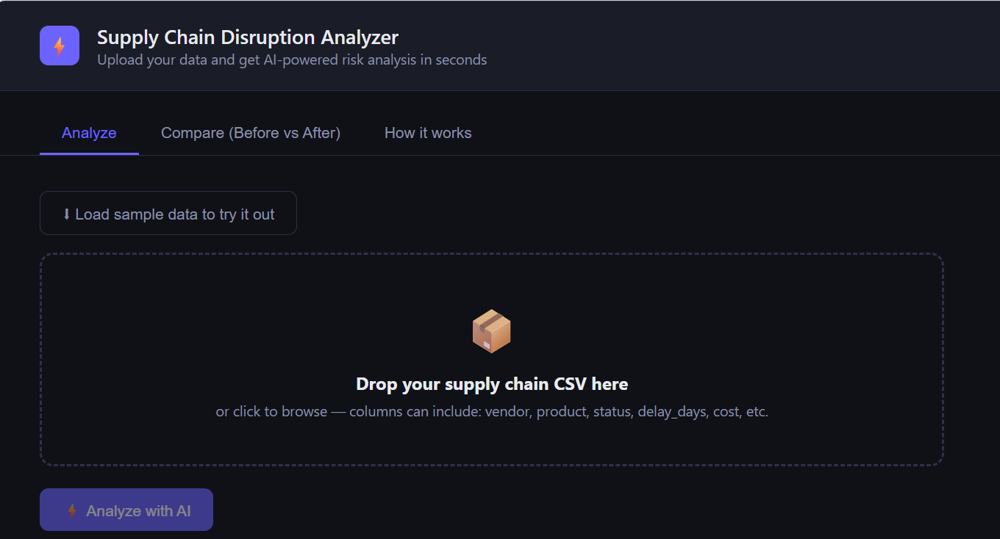

# 🔗 Supply Chain Disruption Analyzer

> AI-powered risk detection for supply chain data — upload a CSV, get instant anomaly detection, risk scores, and plain-English recommendations.

**[Live Demo](https://supply-chain-analyzer.netlify.app/)** · Built by [Victory Orobosa](https://github.com/Victory113)


---

## What it does

Supply chain managers deal with massive CSV exports — shipments, vendors, delays, costs — and no fast way to spot what's actually at risk. This app solves that.

Upload your CSV and the app:

- Identifies your **top 3 risks**, color-coded `HIGH` / `MEDIUM` / `LOW`
- Explains each risk in **plain English** — no data jargon
- Gives a **concrete recommendation** per risk
- Surfaces **healthy signals** in your data so you know what's working
- **Compare mode** — upload two CSVs (before/after a disruption) to see exactly what changed and why

The LLM is grounded in your actual data at inference time, preventing hallucination and ensuring every recommendation is traceable to something real in your dataset.

---

## Tech stack

| Layer | Technology | Why |
|---|---|---|
| Backend | FastAPI (Python) | Async-native — ideal for external API calls |
| AI | Anthropic Claude API | Best-in-class instruction following for structured output |
| Frontend | Vanilla JS / HTML | No build step, instant deployment, zero dependencies |
| Backend hosting | Railway | Auto-detects Python, simple env variable management |
| Frontend hosting | Netlify | Continuous deployment from GitHub, free tier |

---

## Screenshots

> **Upload screen** — drag and drop your CSV or load sample data to try it instantly



---

## Project structure

```
supply-chain-analyzer/
├── backend/
│   ├── main.py              ← FastAPI app + all API routes
│   ├── requirements.txt     ← Python dependencies
│   ├── .env.example         ← Copy to .env and add your API key
│   └── railway.toml         ← Railway deployment config
│
└── frontend/
    └── index.html           ← Complete single-file frontend (no build step)
```

---

## Local setup

### Prerequisites

- Python 3.11+
- An [Anthropic API key](https://console.anthropic.com/) (free to start — $5 in credits on signup)
- Git

### 1. Clone the repo

```bash
git clone https://github.com/YOUR_USERNAME/supply-chain-analyzer.git
cd supply-chain-analyzer
```

### 2. Set up the backend

```bash
cd backend
python -m venv venv

# Mac/Linux:
source venv/bin/activate
# Windows:
venv\Scripts\activate

pip install -r requirements.txt
cp .env.example .env
```

Open `.env` and add your Anthropic API key:

```
ANTHROPIC_API_KEY=your_key_here
```

### 3. Run the backend

```bash
uvicorn main:app --reload
```

Visit `http://localhost:8000` — you should see `{"message": "Supply Chain Analyzer API is running!"}`

### 4. Run the frontend

Open a new terminal tab (keep the backend running):

```bash
cd frontend
python -m http.server 3000
```

Visit `http://localhost:3000` and the full app UI will load.

### 5. Test it end-to-end

1. Click **"Load sample data to try it out"**
2. Click **"Analyze with AI"**
3. Watch it call your backend → Claude → render results

---

## How the AI works

The prompt is engineered to return **structured JSON**, which the frontend renders dynamically. This means:

- No string parsing fragility — the response is always machine-readable
- Risk levels (`HIGH` / `MEDIUM` / `LOW`) are always consistent
- The compare feature sends both datasets in a single prompt and asks the model to reason about what changed between them
- The API key lives only in the backend environment — it never touches the frontend or the client

---

## Deployment

### Backend → Railway

1. Push your repo to GitHub
2. Go to [railway.app](https://railway.app) → New Project → Deploy from GitHub
3. Add environment variable: `ANTHROPIC_API_KEY = your_key`
4. Railway auto-detects Python and deploys — you'll get a live URL

### Frontend → Netlify

1. Go to [netlify.com](https://netlify.com) → Add new site → Import from GitHub
2. Set base directory to `frontend`
3. No build command needed
4. In `frontend/index.html`, update the API constant to your Railway URL:

```javascript
const API = window.location.hostname === 'localhost'
  ? 'http://localhost:8000'
  : 'https://your-app.up.railway.app';
```

5. Push and Netlify auto-redeploys

---

## What's next

- [ ] Risk distribution chart (Chart.js)
- [ ] CSV column mapping — let users label what each column means
- [ ] Export analysis as a PDF report
- [ ] Historical tracking — store past analyses in SQLite
- [ ] Real dataset integration (USDA food supply data from data.gov)

---

## Author

**Victory Orobosa** — CS Senior @ University of Central Arkansas  
[LinkedIn](https://linkedin.com/in/YOUR_HANDLE) · [GitHub](https://github.com/YOUR_USERNAME) · [Live Demo](https://supply-chain-analyzer.netlify.app/)
